# 知识库平台功能架构图 + 用户角色图 + 页面地图

## 0. 文档定位
这份文档是“面向 Agent 工作流的企业级知识中台”从整体方案进入产品设计阶段的第一份骨架文档。

它解决 3 个问题：
1. 平台有哪些核心能力，彼此如何分层
2. 平台有哪些角色，分别做什么，如何协作
3. 平台应该有哪些页面，各端怎么组织导航

这份内容后面可以直接衔接：
- 交互原型图
- 高保真设计图
- PRD 文档
- 字段与状态机设计
- Agent 联动展示页

---

# 1. 平台整体功能架构图

## 1.1 总体功能架构

```mermaid
flowchart TB
    A[知识库平台 / 企业级知识中台]

    A --> B1[接入层]
    A --> B2[处理层]
    A --> B3[治理层]
    A --> B4[服务层]
    A --> B5[运营层]
    A --> B6[平台管理层]

    B1 --> C11[手工录入]
    B1 --> C12[模板录入]
    B1 --> C13[文件导入]
    B1 --> C14[第三方同步]
    B1 --> C15[API接入]

    B2 --> C21[文档解析]
    B2 --> C22[文本清洗]
    B2 --> C23[切片Chunking]
    B2 --> C24[标签分类]
    B2 --> C25[去重合并]
    B2 --> C26[向量化/索引构建]

    B3 --> C31[审核发布]
    B3 --> C32[版本管理]
    B3 --> C33[生命周期管理]
    B3 --> C34[责任人机制]
    B3 --> C35[质量校验]
    B3 --> C36[权限控制]

    B4 --> C41[全文检索]
    B4 --> C42[语义检索]
    B4 --> C43[混合召回]
    B4 --> C44[结果重排]
    B4 --> C45[引用返回]
    B4 --> C46[Agent/RAG API]
    B4 --> C47[Workflow节点调用]

    B5 --> C51[搜索分析]
    B5 --> C52[问答命中分析]
    B5 --> C53[零结果分析]
    B5 --> C54[热门知识排行]
    B5 --> C55[反馈闭环]
    B5 --> C56[维护任务看板]

    B6 --> C61[组织与租户管理]
    B6 --> C62[角色权限管理]
    B6 --> C63[空间与目录配置]
    B6 --> C64[模板与词库配置]
    B6 --> C65[模型与检索策略配置]
    B6 --> C66[日志审计与安全配置]
```

---

## 1.2 按业务视角拆解的 10 大模块

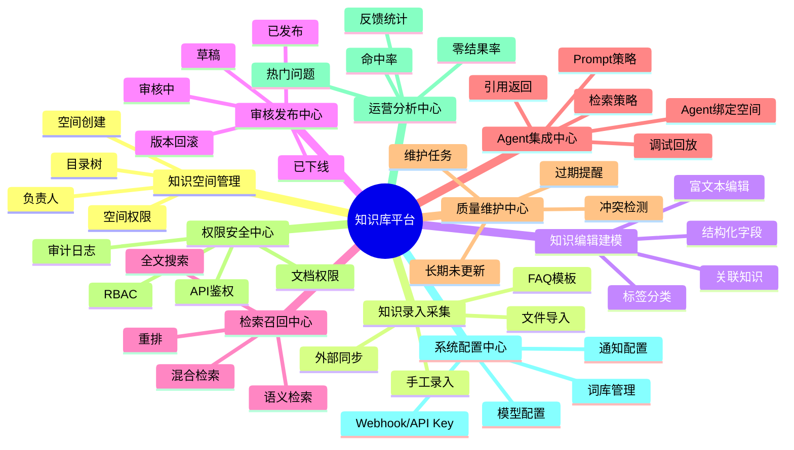

---

## 1.3 平台能力到前台/后台的映射

| 能力域 | 管理后台 | 运营工作台 | 检索调试台 | 业务使用端 | Agent集成端 |
|---|---|---|---|---|---|
| 知识空间管理 | 是 | 部分可见 | 否 | 否 | 部分可见 |
| 知识录入与编辑 | 部分 | 是 | 否 | 否 | 否 |
| 审核发布 | 是 | 是 | 否 | 否 | 否 |
| 检索召回 | 配置 | 部分 | 是 | 是 | 是 |
| Agent 绑定 | 配置 | 否 | 部分验证 | 否 | 是 |
| 维护与质量 | 是 | 是 | 部分 | 否 | 部分 |
| 运营分析 | 是 | 是 | 是 | 否 | 是 |
| 权限与安全 | 是 | 否 | 否 | 否 | 部分 |
| 系统配置 | 是 | 否 | 部分 | 否 | 部分 |

---

## 1.4 功能架构设计要点

### A. 平台不是一个端，而是五个工作域
建议产品设计时从一开始就拆成 5 个工作域：
1. 管理后台
2. 知识运营工作台
3. 检索调试台
4. 业务使用端
5. Agent 集成端

如果把这些全部揉成一个后台，后面导航会很乱，角色权限也会变复杂。

### B. 录入、治理、服务、运营必须闭环
功能架构必须支持这条主链路：
**知识进入 → 被治理 → 被召回 → 被引用 → 被反馈 → 被维护**

### C. Agent 集成必须独立成一级模块
不要把 Agent 绑定和检索调试埋在“系统设置”里。那样很快就会变成没人敢碰的黑盒角落。

---

# 2. 用户角色图

## 2.1 用户角色总览

平台建议采用“平台治理角色 + 内容生产角色 + AI集成角色 + 使用消费角色”四层角色体系。

### 一层：平台治理角色
- 平台管理员
- 安全/审计人员

### 二层：知识生产与治理角色
- 知识管理员 / 知识运营
- 录入人员 / 编辑人员
- 审核人员
- 业务负责人

### 三层：AI 集成角色
- Agent 配置人员 / AI 产品经理
- 工作流编排人员 / 应用开发人员

### 四层：知识消费角色
- 普通业务用户
- 业务系统 / 外部系统
- Agent / Copilot / 智能助手

---

## 2.2 用户角色关系图

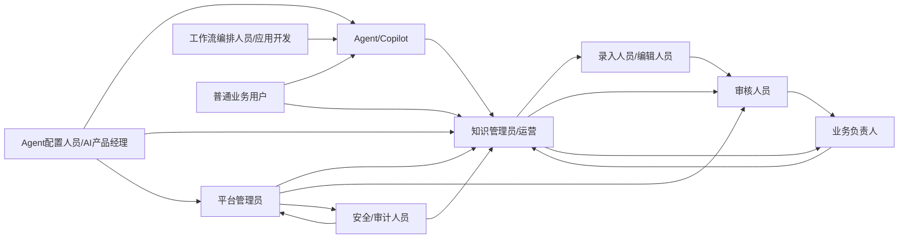

这张图可以这么理解：
- 平台管理员负责搭平台和设规则
- 知识管理员负责把平台跑起来
- 编辑与审核负责把知识变成可信内容
- AI 产品经理把知识真正接到 Agent 上
- 普通用户和 Agent 是最终消费知识的人/系统
- 安全审计负责兜底

---

## 2.3 角色职责矩阵

| 角色 | 核心职责 | 重点页面 | 关键权限 |
|---|---|---|---|
| 平台管理员 | 平台配置、组织与权限、模型策略、安全审计 | 管理后台 | 全局配置、角色授权、系统配置 |
| 知识管理员/运营 | 空间规划、模板管理、质量运营、维护闭环 | 管理后台、运营工作台 | 空间管理、模板管理、运营分析 |
| 录入人员/编辑人员 | 创建知识、补全字段、提交审核 | 运营工作台 | 新建/编辑草稿、导入文档 |
| 审核人员 | 审核知识准确性与合规性、发布与退回 | 运营工作台、审核中心 | 审核、发布、退回、查看版本 |
| 业务负责人 | 对业务域知识负责、审批关键内容 | 审核中心、看板 | 审批、查看域内质量与使用情况 |
| Agent配置人员/AI产品经理 | Agent绑定知识空间、检索策略调试、效果优化 | Agent集成端、检索调试台 | 配置绑定、查看调试日志、策略配置 |
| 工作流编排/应用开发 | 在流程/应用中调用知识服务 | Agent集成端 | 调用API、配置Workflow节点 |
| 普通业务用户 | 搜索知识、查看详情、反馈纠错 | 业务使用端 | 搜索、查看授权知识、提交反馈 |
| Agent/Copilot | 检索知识并返回答案与引用 | Agent集成端（间接） | 按绑定策略调用知识服务 |
| 安全/审计人员 | 检查权限、审计日志、敏感访问 | 管理后台 | 查看审计、权限检查、合规分析 |

---

## 2.4 推荐的权限模型

### 一期建议
采用：
- **RBAC 为主**
- **空间级 + 文档级权限控制**
- **Agent 侧调用继承空间权限策略**

### 后续扩展
预留：
- 字段级权限
- 基于标签/部门/密级的 ABAC 扩展
- 特定 Agent 白名单策略

---

## 2.5 角色协作主流程

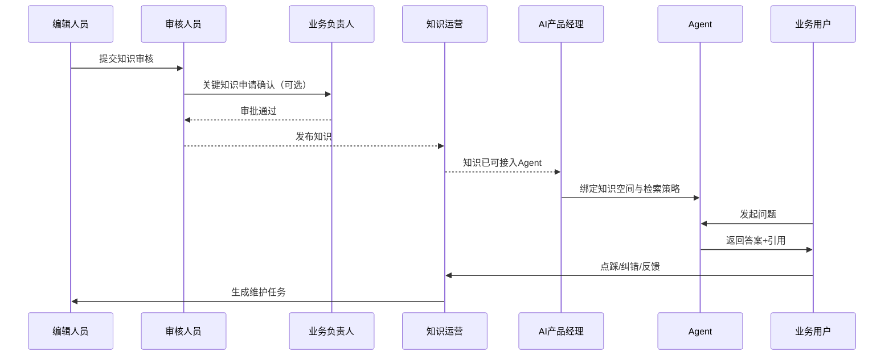

---

# 3. 页面地图

这里的页面地图不是简单列菜单，而是按端来组织信息架构。这样后面做原型才不会乱。

---

## 3.1 总体页面地图

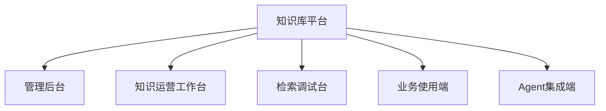

---

## 3.2 管理后台页面地图

### 适用角色
- 平台管理员
- 知识管理员
- 安全/审计人员

### 页面结构

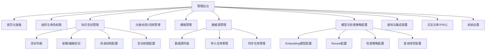

### 管理后台导航建议
1. 首页仪表盘
2. 知识组织
   - 知识空间管理
   - 分类管理
   - 标签管理
   - 词库管理
3. 平台配置
   - 模板管理
   - 数据源管理
   - 模型配置
   - 检索策略配置
4. 权限安全
   - 用户与角色
   - 权限策略
   - 审计日志
5. 系统管理
   - 通知配置
   - API / Webhook
   - 系统设置

---

## 3.3 知识运营工作台页面地图

### 适用角色
- 知识管理员 / 运营
- 编辑人员
- 审核人员
- 业务负责人

### 页面结构

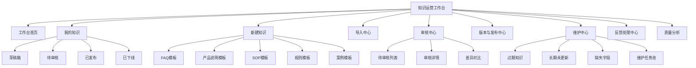

### 运营工作台导航建议
1. 工作台首页
2. 我的知识
3. 新建知识
4. 导入中心
5. 审核中心
6. 发布与版本
7. 维护中心
8. 用户反馈
9. 质量分析

### 原型重点页面
后面做原型时，这几个页优先级最高：
- 新建知识页
- 知识详情编辑页
- 审核详情页
- 版本对比页
- 维护任务页

---

## 3.4 检索调试台页面地图

### 适用角色
- AI 产品经理
- 检索策略配置人员
- 算法 / 数据人员
- 平台管理员（部分）

### 页面结构

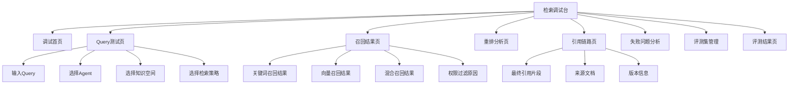

### 调试台导航建议
1. Query 测试
2. 召回结果
3. 重排分析
4. 引用链路
5. 失败问题分析
6. 评测集管理
7. 评测结果

### 调试台必须做的 4 个页面
如果你想让平台后面真能调优，这 4 页一页都不能少：
- Query 测试页
- 召回结果页
- 引用链路页
- 失败问题分析页

---

## 3.5 业务使用端页面地图

### 适用角色
- 普通业务用户
- 客服
- 销售
- 运营
- 内部员工

### 页面结构

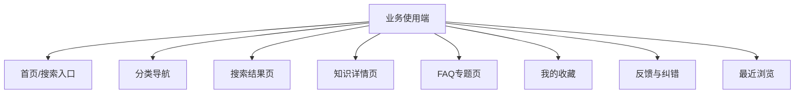

### 业务使用端导航建议
1. 首页
2. 分类导航
3. FAQ 专题
4. 我的收藏
5. 最近浏览
6. 反馈记录

### 业务端体验原则
- 搜索必须足够快
- 结果必须可读
- 引用来源要清楚
- 反馈入口要简单
- 不要把后台概念带给普通用户

---

## 3.6 Agent 集成端页面地图

### 适用角色
- AI 产品经理
- 应用开发
- 工作流编排人员
- 平台管理员（部分）

### 页面结构

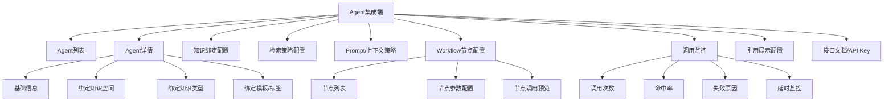

### Agent 集成端导航建议
1. Agent 列表
2. Agent 详情
3. 知识绑定
4. 检索策略
5. Prompt 策略
6. Workflow 节点配置
7. 调用监控
8. API / Key 管理

### 后续一定要重点设计的页面
- Agent 绑定知识空间页
- 检索策略配置页
- Workflow 节点配置页
- 调用监控页

---

# 4. 跨端页面关系图

## 4.1 端与端之间的配合关系

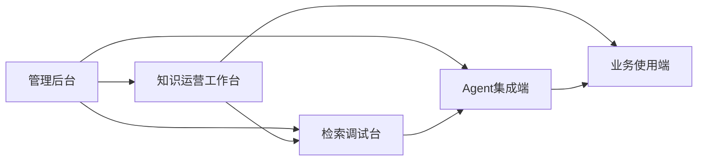

关系解释：
- 管理后台负责规则和底座
- 运营工作台负责内容生产与治理
- 检索调试台负责效果验证
- Agent 集成端负责把知识接到 Agent
- 业务使用端负责最终消费

---

## 4.2 页面流转主链路

### 链路一：知识生产链路
管理后台配置空间/模板 → 运营工作台录入知识 → 审核发布 → 进入检索服务

### 链路二：Agent 接入链路
管理后台配置检索策略 → Agent 集成端绑定知识空间 → 检索调试台验证 → Agent 正式调用

### 链路三：用户反馈优化链路
业务使用端查看知识/答案 → 提交反馈 → 运营工作台处理 → 调试台复盘 → 再次发布优化版本

---

# 5. 推荐的导航层级设计

为了后续后台不乱，建议统一采用：

## 一级导航
- 总览
- 知识管理
- 审核发布
- 维护运营
- 检索调试
- Agent 集成
- 平台配置
- 权限安全

## 二级导航示例
### 知识管理
- 知识空间
- 我的知识
- 新建知识
- 导入中心
- 分类标签
- 模板管理

### 审核发布
- 待审核
- 审核记录
- 发布记录
- 版本中心

### 维护运营
- 维护任务
- 过期知识
- 反馈处理
- 质量分析
- 运营看板

### 检索调试
- Query 测试
- 召回结果
- 重排分析
- 引用链路
- 失败问题分析
- 评测集

### Agent 集成
- Agent 列表
- 知识绑定
- 检索策略
- Workflow 节点
- 调用监控
- API 管理

### 平台配置
- 数据源
- 模型配置
- 词库配置
- 通知配置
- 系统设置

### 权限安全
- 用户与角色
- 权限策略
- 审计日志
- 合规配置

---

# 6. 原型设计阶段的页面优先级

不是所有页面都要同时画。建议按优先级推进。

## P0：第一批必须画
这些页面会决定产品骨架：
1. 管理后台首页
2. 知识空间管理页
3. 新建知识页
4. 知识详情编辑页
5. 审核详情页
6. 搜索结果页
7. 知识详情页
8. Query 测试页
9. 召回结果页
10. Agent 绑定知识空间页
11. Workflow 节点配置页
12. 调用监控页

## P1：第二批建议画
1. 版本对比页
2. 维护任务页
3. 反馈处理页
4. 质量分析页
5. 检索策略配置页
6. API 管理页

## P2：后续增强再画
1. 多数据源同步页
2. 高级权限页
3. 自动标签与质量评分页
4. 评测集管理高级页

---

# 7. 当前版本的直接用途

这份《功能架构图 + 用户角色图 + 页面地图》现在可以直接用于：

## 用途一：进入低保真原型设计
可以按五个端分别开始画框架页。

## 用途二：拆 PRD 目录
可以按：
- 管理后台
- 运营工作台
- 调试台
- 业务端
- Agent 端
逐模块展开需求。

## 用途三：拆研发任务
可以按能力域分给不同角色：
- 后台与权限
- 内容与审核
- 检索与调试
- Agent 集成
- 运营分析

---

# 8. 结论

如果说上一份整体方案解决的是“做什么”，那这一份解决的是“系统骨架怎么搭”。

一句话总结：

**这个平台应该以“五端协同、六层能力、十个核心模块”为骨架，围绕知识治理与 Agent 服务双主线来组织产品结构。**

这样往下继续做：
- 原型图不会散
- PRD 不会乱
- 字段设计不会脱节
- Agent 联动展示也有清晰承载页面

---

# 9. 建议的下一步

最顺的下一步有两个：

## 方案 A：继续做原型蓝图
我直接给你输出：
- 管理后台原型蓝图
- 运营工作台原型蓝图
- 检索调试台原型蓝图
- Agent 集成端原型蓝图
- 业务使用端原型蓝图

## 方案 B：继续做 PRD 总目录
我直接给你搭：
- PRD 总文档目录
- 一级模块需求清单
- 各页面需求项
- 状态机与校验点

如果你要效率最高，我建议下一步直接做：

**《核心页面原型蓝图（低保真）》**

因为现在平台骨架已经立好了，下一步就该把关键页面长出来。